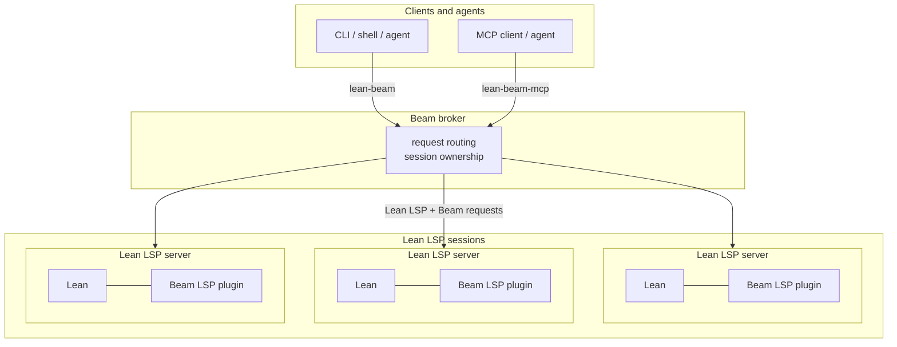

# Lean Beam

Lean Beam gives AI-assisted and tool-assisted workflows a small, structured way to ask Lean
questions inside real projects. Its central operation is speculative execution: a client sends
[`runAt`](docs/STATUS.md#core-lean-surface) for a position in a saved file and a Lean command or
tactic, and Beam checks whether that text would work there without changing the file.

`runAt` is exposed by the [`lean-beam` CLI](docs/SETUP.md#use-beam-from-a-lean-project) as
[`lean-beam run-at`](docs/SETUP.md#use-beam-from-a-lean-project) and through MCP as
[`lean_run_at`](docs/MCP.md#client-tool-semantics). Because these probes can be issued
concurrently, agents and tools can cheaply explore several "would this work here?" possibilities in
the real module context.

Beam combines [Lean LSP extensions](docs/STATUS.md#core-lean-surface) with a thin local broker. The
extensions provide Lean-specific capabilities, and the broker exposes them through CLI and
[MCP](docs/SETUP.md#mcp-setup) interfaces while coordinating one or more Lean LSP sessions.

Together, the LSP extensions, CLI, and MCP interface make this loop cheaper and more structured than
repeatedly creating scratch files or using full `lake build` runs as the inner loop. Beam is
implemented in Lean, which lets it integrate directly with Lean server state, saved snapshots, and
synchronization where that matters.

We have found Beam useful for proof repair, proof search experiments, proof translation and porting,
autoformalization experiments, and regular AI-assisted Lean editing.

Feedback is welcome through GitHub issues or Lean Zulip. For structured bug reports from a local
checkout, `lean-beam feedback --stdin` can produce a pasteable report card; see
[docs/FEEDBACK.md](docs/FEEDBACK.md).

Lean Beam is experimental beta software. It is not an official Lean FRO product. Current
scope, limitations, and release direction are tracked in [docs/STATUS.md](docs/STATUS.md).

Most readers should start with [Install](#install), then use [docs/SETUP.md](docs/SETUP.md) for
toolchains, first CLI commands, agent-skill setup, and MCP registration. Release notes and changes
are tracked in [CHANGELOG.md](CHANGELOG.md).

## Install

Install or update Beam from a Lean Beam checkout:

```bash
./scripts/install-beam.sh
```

Run the installer again when you update the checkout and want the installed runtime to match it.
Setup details, supported toolchains, agent-skill installation, MCP registration, direct CLI
examples, installer locations, overrides, and offline advice live in
[docs/SETUP.md](docs/SETUP.md).

Lean Beam serves validated Lean toolchains listed in
[`supported-lean-toolchains`](supported-lean-toolchains). See
[docs/SETUP.md](docs/SETUP.md#supported-toolchains-and-bundles) for bundle setup and
[docs/CUSTOM_TOOLCHAINS.md](docs/CUSTOM_TOOLCHAINS.md) for explicitly accepted local Lean builds.

## Current Beta Surface

The current development line includes support for:

- speculative Lean execution with [`runAt`](docs/STATUS.md#core-lean-surface)
- incremental synchronization of Lean's view of a file after edits with
  [`sync`](docs/SYNC_AND_DIAGNOSTICS.md#command-model)
- actionable file information with [`todo`](docs/STATUS.md#core-lean-surface), including sorries,
  holes, diagnostics, code actions, and incomplete proofs
- saving `.olean` artifacts from an interactive session with
  [`save`](docs/SYNC_AND_DIAGNOSTICS.md#command-model)
- selected Lean/LSP features through the same
  [CLI](docs/SETUP.md#use-beam-from-a-lean-project) and
  [MCP](docs/MCP.md#client-tool-semantics) interfaces, including hover, signature help,
  definitions, references, document/workspace symbols, and proof-state inspection
- feedback report cards for bug reports and project feedback through
  [`lean-beam feedback`](docs/FEEDBACK.md) and MCP [`beam_feedback`](docs/FEEDBACK.md#mcp)

See [docs/STATUS.md](docs/STATUS.md) for the current supported surface, known limitations, and
release direction.

## Architecture At A Glance

Most clients only need the CLI or MCP surface, but the split below explains where request routing
and Lean state live.



Clients talk to the broker, and the broker owns request routing plus one or more Lean LSP sessions
with the Beam plugin loaded.

## Documentation Map

For users:

- [docs/SETUP.md](docs/SETUP.md): install, toolchain, first-use, MCP, and installer reference.
- [docs/CUSTOM_TOOLCHAINS.md](docs/CUSTOM_TOOLCHAINS.md): explicit local Lean toolchain support.
- [docs/COMPATIBILITY.md](docs/COMPATIBILITY.md): pre-stable compatibility policy and supported
  targets.
- [docs/ROCQ.md](docs/ROCQ.md): optional Rocq goal probes for Rocq-to-Lean porting.
- [docs/FEEDBACK.md](docs/FEEDBACK.md): feedback report cards for useful bug reports.
- [docs/STATUS.md](docs/STATUS.md): current scope, limitations, and direction.
- [CHANGELOG.md](CHANGELOG.md): release notes and changes.

For agent workflows:

- [skills/lean-beam/SKILL.md](skills/lean-beam/SKILL.md): Lean workflow contract.
- [skills/rocq-beam/SKILL.md](skills/rocq-beam/SKILL.md): auxiliary Rocq workflow surface.

For contributors and maintainers:

- [CONTRIBUTING.md](CONTRIBUTING.md): commit, PR, and contributor workflow guidance.
- [docs/DEVELOPMENT.md](docs/DEVELOPMENT.md): maintainer workflow and implementation notes.
- [docs/TESTING.md](docs/TESTING.md): developer test-suite guidance and coverage map.
- [docs/SYNC_AND_DIAGNOSTICS.md](docs/SYNC_AND_DIAGNOSTICS.md): sync, save, progress,
  diagnostics, and readiness contract.
- [docs/MCP.md](docs/MCP.md): current MCP maintainer architecture and conformance notes.
- [AGENTS.md](AGENTS.md): repo-specific agent instructions.

## Contributing and Help

The main goal of the beta development cycle is to gather feedback from Lean users and tool authors.
Bug reports, design feedback, and documentation improvements are welcome through
[GitHub issues](https://github.com/ejgallego/lean-beam/issues). Discussion is also welcome on the
[Lean Zulip](https://leanprover.zulipchat.com).

Before contributing code or docs, read [CONTRIBUTING.md](CONTRIBUTING.md). Maintainer workflow notes
live in [docs/DEVELOPMENT.md](docs/DEVELOPMENT.md).

## License

Apache-2.0. See [LICENSE](LICENSE).
