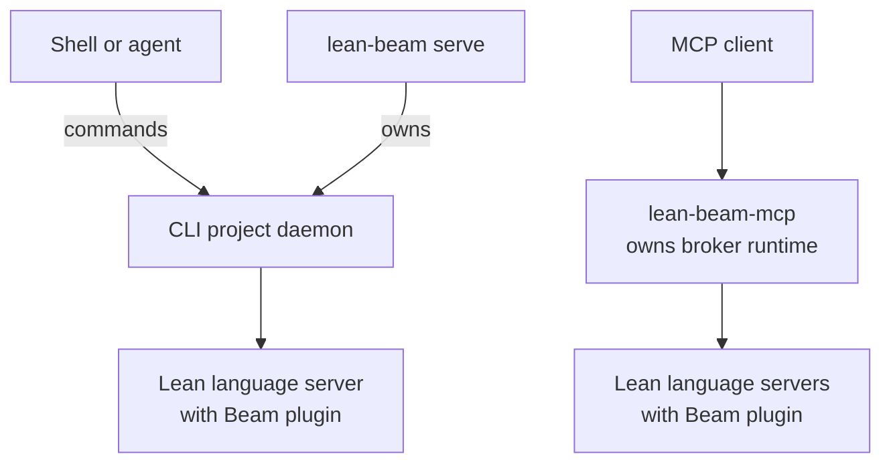

# Lean Beam

Lean Beam lets AI agents and other tools try Lean commands and tactics in a project's existing
context. Ask whether a tactic would work at a position in a saved file, inspect the result, and
then decide whether to edit the source. Each attempt starts from the file's Lean state at that
position, so you can explore alternatives independently.

The central operation is [`runAt`](docs/STATUS.md#core-lean-surface), available through the
[`lean-beam` CLI](docs/SETUP.md#use-beam-from-a-lean-project) and an
[MCP server](docs/SETUP.md#mcp-setup). Beam also provides proof-state inspection, diagnostics,
navigation, and development checkpoints. We use it for proof repair, proof search, porting, and
AI-assisted Lean editing.

Beam is a preview: it is installed separately from Lean, and its interfaces may change. See
[Status](docs/STATUS.md) for current capabilities and limitations, and
[Compatibility](docs/COMPATIBILITY.md) for supported targets.

## Install

You need `elan` on `PATH` and a
[supported Lean toolchain](docs/SETUP.md#validated-and-compatible-toolchains).
From a Lean Beam checkout, run:

```bash
./scripts/install-beam.sh
```

The installer offers toolchain, agent-skill, and MCP client setup. It installs the wrappers in
`~/.local/bin`; make sure that directory is on `PATH`. Run the installer again after updating the
checkout to update your installed runtime.

For agent-specific installation, MCP registration, custom toolchains, and offline setup, follow the
[setup guide](docs/SETUP.md).

## Try a tactic

After installation, open a terminal in the Lean project you want to work on and start a session:

```bash
cd /path/to/lean/project
lean-beam serve
```

Keep that process running. For this example, create and save a new file named `Demo.lean` in the
project root containing exactly:

```lean
example : True := by
  sorry
```

In a second terminal in that project, use the following commands. This example uses Python 3 to
extract the document version from Beam's JSON response:

```bash
update_json="$(lean-beam update Demo.lean)"
version="$(printf '%s\n' "$update_json" | python3 -c 'import json,sys; print(json.load(sys.stdin)["result"]["version"])')"
lean-beam run-at Demo.lean "$version" 1 2 "exact True.intro"
```

Line `1`, character `2` selects the start of `sorry`: lines and characters are zero-based, and
characters count UTF-16 code units. Beam checks `exact True.intro` against the goal before that
tactic. The response reports that the attempt succeeded with no remaining goals; `Demo.lean` still
contains `sorry`. The document version ties the request to the file state returned by `update`.

To keep the proof, replace `sorry` with `exact True.intro` in the file, save it, and ask Beam for
fresh diagnostics:

```bash
lean-beam sync Demo.lean
```

When you finish, interrupt the `lean-beam serve` process to close the session. MCP clients own their
sessions automatically. For more CLI examples and session troubleshooting, see
[Use Beam from a Lean project](docs/SETUP.md#use-beam-from-a-lean-project).

## More than tactic checks

You can inspect goals, hover information, definitions, and references through the CLI or MCP.
[`todo`](docs/STATUS.md#core-lean-surface) finds actionable items such as sorries, holes,
diagnostics, and code actions. Independent speculative requests can run concurrently, allowing
agents to explore several candidates against the same file state.

After editing a file, [`sync`](docs/SYNC_AND_DIAGNOSTICS.md#command-model) waits for its current
diagnostics. [`save`](docs/SYNC_AND_DIAGNOSTICS.md#command-model) writes a development `.olean`
checkpoint for one module from the Lean server's accepted state. Use clean CI `lake build` results
for final project validation; the
[checkpoint guide](docs/SYNC_AND_DIAGNOSTICS.md#development-checkpoints-and-batch-validation)
explains the distinction and when a local batch build is needed.

## How Beam connects to Lean

Beam is implemented in Lean. A Lean language-server plugin provides operations such as `runAt`, and
a local broker manages requests and file state. The CLI and MCP server reuse broker code but own
separate sessions:


```mermaid
flowchart TB
  cli["Shell or agent"] -- commands --> cliBroker["CLI project daemon"]
  owner["lean-beam serve"] -- owns --> cliBroker
  cliBroker --> cliLean["Lean language server<br/>with Beam plugin"]

  client["MCP client"] --> mcp["lean-beam-mcp<br/>owns broker runtime"]
  mcp --> mcpLean["Lean language servers<br/>with Beam plugin"]
```

Ordinary CLI commands attach to the session started by `lean-beam serve`. The MCP server creates
sessions as clients request local projects; it does not attach to the CLI daemon. Maintainer
explanations live in [Development](docs/DEVELOPMENT.md) and [MCP](docs/MCP.md).

## Find the right guide

For using Beam:

- [Setup](docs/SETUP.md): installation, first commands, toolchains, and MCP registration.
- [Status](docs/STATUS.md): current capabilities, limitations, and direction.
- [Compatibility](docs/COMPATIBILITY.md) and [custom toolchains](docs/CUSTOM_TOOLCHAINS.md):
  supported releases and local Lean builds.
- [Rocq](docs/ROCQ.md): optional goal inspection through `coq-lsp` for porting work.
- [Lean skill](skills/lean-beam/SKILL.md) and [Rocq skill](skills/rocq-beam/SKILL.md):
  instructions for agents using the installed tools.
- [Changelog](CHANGELOG.md): release changes.

For contributing or integrating tools:

- [Contributing](CONTRIBUTING.md): contributor workflow and writing guidance.
- [Development](docs/DEVELOPMENT.md): implementation and maintainer workflows.
- [MCP](docs/MCP.md): tools, protocol behavior, and conformance.
- [Sync and diagnostics](docs/SYNC_AND_DIAGNOSTICS.md): file versions, readiness, and recovery.
- [Testing](docs/TESTING.md): test suites and coverage.
- [Agent instructions](AGENTS.md): repository-specific development rules.

## Help and feedback

Bug reports, design feedback, and documentation improvements are welcome through
[GitHub issues](https://github.com/leanprover/lean-beam/issues) or
[Lean Zulip](https://leanprover.zulipchat.com).

For a structured bug report, use `lean-beam feedback-report --stdin` as described in the
[feedback guide](docs/FEEDBACK.md). Beam returns the report locally. Review it before sharing;
for a non-public workspace, set `"confidential": true` in the input and share only privately.

## License

Apache-2.0. See [LICENSE](LICENSE).
